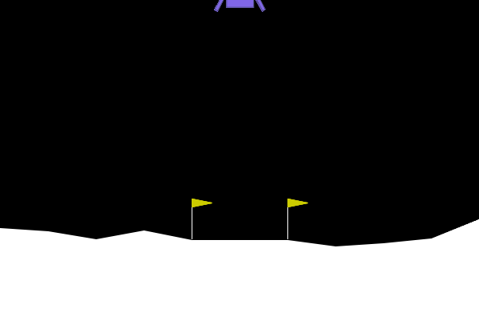

## DDPG

Untrained             |  Trained Actor
:-------------------------:|:-------------------------:
  |  

This repository contains an implementation of Deep Deterministic Policy Gradients [(DDPG)](https://arxiv.org/abs/1509.02971) which is a model-free reinforcement learning algorithm designed for continuous action spaces, utilizing an actor-critic architecture.

In `ddpg.ipynb` DDPG is implemented and well explained. It is then used to safely land a lunarlander from [Gymnasium environments](https://gymnasium.farama.org/environments/box2d/lunar_lander/).